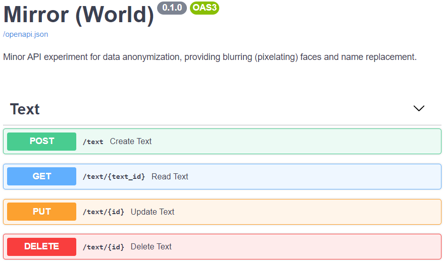

## mirror

minor API experiment for data anonymization, providing blurring (pixelating) faces and name tagging.

## local usage

- clone the repository`git clone https://github.com/vncsna/mirror.git`
- change directory to repo folder `cd mirror`
- install the required libraries `pip install -r requirements.txt`
- open the app directory `cd app`
- start the app server `uvicorn main:app --reload`
- open the web api `localhost:8000/docs`

## docker usage

- clone the repository`git clone`
- change directory to repo folder `cd mirror`
- build the docker image `docker build -t mirror .`
- run the docker container `docker run -d --name wonderland -p 80:80 mirror`
- open the web api `localhost/docs`

## screenshot

## references

images from [Free Images](https://www.freeimages.com/).
